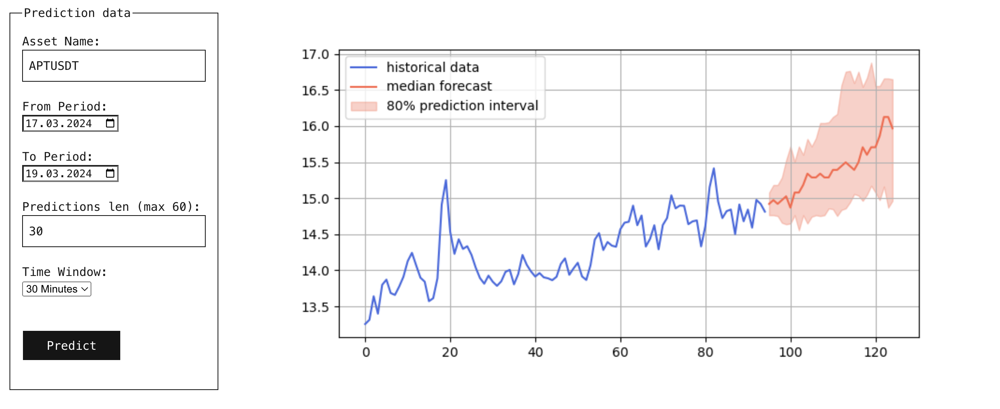

# Binance time series forecasting

Welcome to Binance Price Prediction demo, a humble showcase leveraging `amazon-science/chronos-forecasting` for time series forecasting. This demo provides a glimpse into the Chronos model's capabilities by fetching and forecasting cryptocurrency prices from Binance.

## Features

This demo allows users to interact with the platform to customize their predictions based on various parameters:

- **Asset Name**: Choose different cryptocurrency pairs like APTUSDT, BTCUSDT, etc.
- **From Period**: Select the starting date for the price data.
- **To Period**: Choose the ending date for the price data.
- **Predictions Length**: Determine the number of future data points you wish to forecast.
- **Time Window**: Set the time interval for each data point (e.g., 30 minutes, 1 hour).

## About Chronos Forecasting

Chronos stands as an innovative approach to time series forecasting, utilizing language model architectures. It transforms a time series into a sequence of tokens through scaling and quantization.

A language model is then trained on these tokens with a cross-entropy loss function, enabling Chronos to offer probabilistic forecasts. These models are trained on a broad array of both public time series data and synthetic data created through Gaussian processes.

## Probabilistic Forecasts

This demo generates probabilistic forecasts by simulating multiple future trajectories with the historical data provided, offering a useful tool for understanding the uncertainty in predictions.

## Challenges

According to chronos paper, model struggles with exponential tasks. And it underestimate the trend when the context is not sufficiently long, what is shown on pictures below.

'Just a time series'

'Just a time series' 4 times.

## Disclaimer

This is a demo and for demonstration purposes only. It utilizes historical data to make predictions and does not guarantee future performance.

## License

This project is under the MIT License - see the LICENSE file for more information.

## Acknowledgments

- Our thanks go to the `amazon-science/chronos-forecasting` team for their pioneering efforts in time series forecasting.
- Gratitude to Binance for providing the API for fetching real-time cryptocurrency data.
